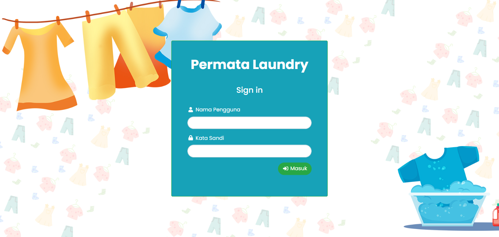
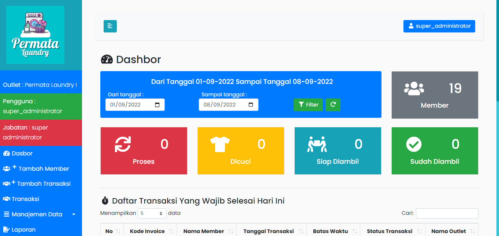
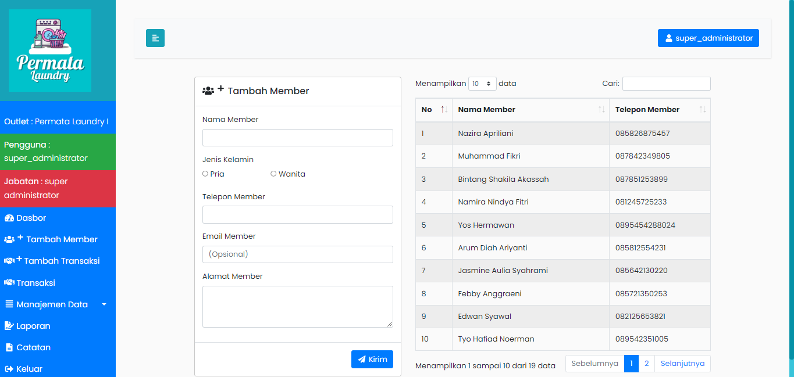
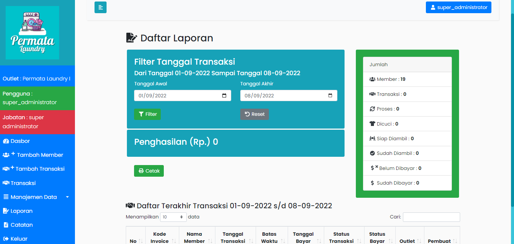

# Aplikasi Laundry berbasis Web
Aplikasi Pengolahan Laundry sekaligus bisa mencetak kode invoice yang dapat digunakan untuk mengecek status laundry pelanggan tanpa harus registrasi.
Aplikasi ini dibangun menggunakan PHP versi 7 dengan framework CodeIgniter 3 dan framework Bootstrap 4.

## Tampilan Aplikasi

___
## Fitur-fitur:
- Cetak Invoice Pelanggan
- Mengelola laundry
- Mengelola status laundry
- Mengelola transaksi laundry
- Mengelola dan mencetak omset laundry
- Mengelola pelanggan
- Mengelola pegawai
- Mengelola riwayat aksi
- Mengecek status laundry untuk pelanggan dengan kode invoice
___
## Akun:
Jabatan akun dibagi menjadi 4 yaitu: super administrator, administrator, kasir, owner.
Untuk mengakses akun Admin, pada bagian akhir url tambahkan auth/login. misal: http://localhost/andry_laundry/auth/login
|    Level    |       Username      | Password |
|:-----------:|:----------------- -:|:--------:|
| Super Admin | super_administrator |  12345   |
| Admin       | admin               |  admin   |
| Kasir       | kasir               |  kasir   |
___

## Database
database terdapat dalam folder databases
___

